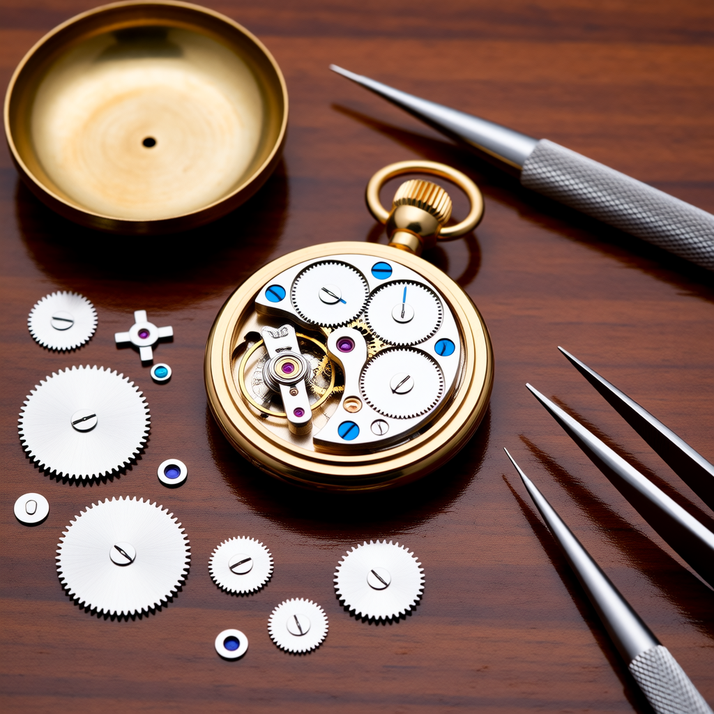
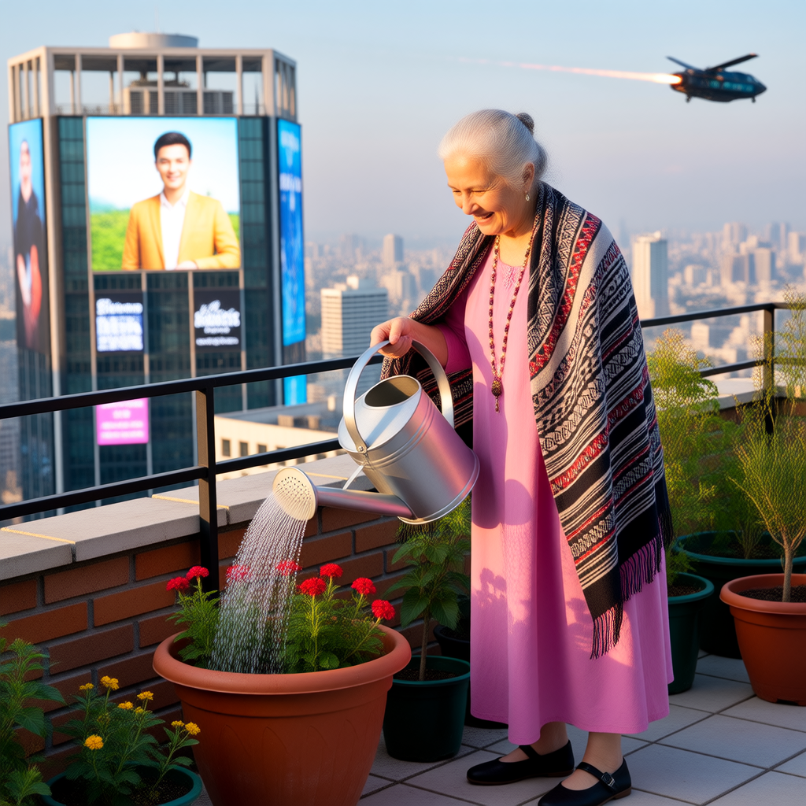

Drag the photo into Comfyui for workflow!

| Flux.1 DEV | Flux.1 DEV 8b GGUF |Flux.1 Krea | Qwen Image | Wan2.2 T2I | 
|-------|-------|-------|-------|-------|
|   |  |  |  |  |
|   |  |  |  |  |
|   |  |  |  |  |
|   |  |  |  |  |
|   |  |  |  |  |
|   |  |  |  |  |
|   |  |  |  |  |

